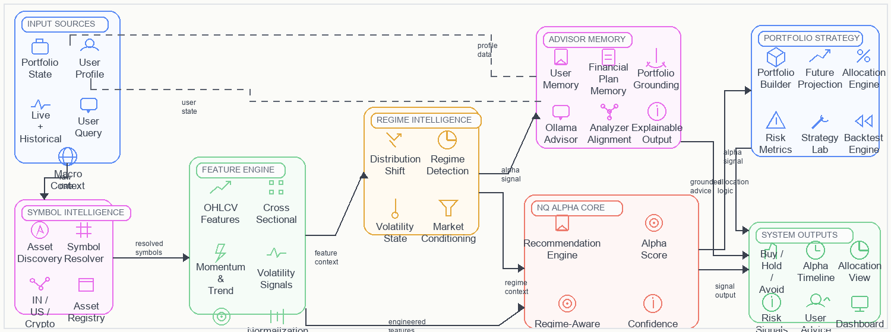

# NQ ALPHA

<p align="center">
  
</p>

NQ ALPHA is a regime-aware AI quant investment decision system that unifies live market analysis, transformer-based alpha inference, portfolio construction, backtesting, user memory, and a grounded local AI advisor into one aligned platform.

Instead of treating analysis, allocation, and explanation as separate tools, NQ ALPHA keeps them connected through a shared decision path:

`symbol intelligence -> feature engine -> regime intelligence -> alpha core -> portfolio strategy -> advisor memory -> system outputs`

## What Makes NQ ALPHA Different

- Regime-aware alpha pipeline with a transformer model and explicit market-state conditioning
- Shared analyzer-advisor truth path so the advisor does not contradict the dashboard
- Rupee-first portfolio planning for real users, with future value projections and saved allocation state
- Multi-market symbol intelligence across Indian equities, US equities, and crypto
- Local-first AI stack using Ollama, FastAPI, PostgreSQL, and ChromaDB
- Protected in-app System Guide and research-paper material for explainability and publication support

## Core Capabilities

### Live Analyzer
- Natural-language asset search and symbol resolution
- Price structure, alpha timeline, regime explanation, and recommendation output
- Confidence scoring and aligned recommendation logic

### Market Scanner
- Ranked opportunity scan across the accessible universe
- Recommendation, alpha, and confidence views in one table
- Fast inference path with cached model and feature state

### Strategy Lab
- Portfolio builder using planned rupee amounts instead of opaque raw weights
- Backtest engine with return, Sharpe, drawdown, volatility, and baseline comparison
- Future-value projection by investment horizon
- Saved portfolio draft and allocation sync

### Allocation Layer
- Exact invested amount, remaining cash, holdings, and capital deployment view
- User-level saved plan and portfolio state

### AI Advisor
- Local Ollama-powered advisor
- Portfolio-state grounding for money questions
- Shared analyzer path for asset-specific advice
- Persistent user memory, financial plan memory, and advisor alignment

### Research / System Guide
- Product view and paper view
- Architecture explanation, alpha mathematics, metric definitions, and roadmap
- Publication-ready paper assets and architecture figure

## Architecture

NQ ALPHA is organized into these major modules:

1. **Input Sources**
   Portfolio state, user profile, live and historical market data, user query, and macro context.

2. **Symbol Intelligence**
   Asset discovery, symbol resolver, cross-market mapping, and persistent asset registry.

3. **Feature Engine**
   OHLCV features, momentum and trend, volatility signals, cross-sectional features, regime features, and normalization plus sequence building.

4. **Regime Intelligence**
   Distribution shift awareness, regime detection, volatility-state analysis, and market conditioning.

5. **NQ Alpha Core**
   Transformer alpha model, regime-aware inference, alpha score, confidence score, and recommendation engine.

6. **Portfolio Strategy**
   Portfolio builder, allocation engine, future projection, risk metrics, Strategy Lab, and backtest engine.

7. **Advisor Memory**
   User memory, financial plan memory, portfolio grounding, Ollama advisor, analyzer alignment, and explainable output.

8. **System Outputs**
   Buy/Hold/Avoid recommendation, alpha timeline, allocation view, risk signals, user advice, and dashboard output.

## Tech Stack

### Backend
- FastAPI
- SQLAlchemy
- PostgreSQL
- ChromaDB
- Ollama
- PyTorch
- yfinance

### Frontend
- React
- Vite
- Tailwind CSS
- Recharts

## Research Assets

Included in this repo:

- Paper markdown: [output/doc/NQ_Alpha_A_Regime_Aware_AI_Quant_Investment_Decision_System.md](output/doc/NQ_Alpha_A_Regime_Aware_AI_Quant_Investment_Decision_System.md)
- Paper DOCX: [output/doc/NQ_Alpha_A_Regime_Aware_AI_Quant_Investment_Decision_System.docx](output/doc/NQ_Alpha_A_Regime_Aware_AI_Quant_Investment_Decision_System.docx)
- Architecture figure: [output/doc/nq_alpha_architecture_paper.png](output/doc/nq_alpha_architecture_paper.png)
- Summary: [output/doc/NQ_Alpha_A_Regime_Aware_AI_Quant_Investment_Decision_System_summary.txt](output/doc/NQ_Alpha_A_Regime_Aware_AI_Quant_Investment_Decision_System_summary.txt)

## Project Structure

```text
backend/                 FastAPI backend, services, DB models, vector memory
frontend/                React dashboard and multi-page UI
agents/                  Alpha, portfolio, and supporting research/training scripts
models/                  Trained alpha and portfolio models
data/                    Local data assets used by the system
output/doc/              Research paper and architecture outputs
logs/                    Evaluation logs, plots, and extracted reference text
scripts/                 Utility scripts and backend launch helpers
```

## Running Locally

### Backend
```powershell
uvicorn backend.main:app --reload
```

### Frontend
```powershell
npm.cmd --prefix frontend run dev
```

## Local Requirements

For the full system, make sure these are available locally:

- PostgreSQL
- Ollama running on `http://localhost:11434`
- Python dependencies from the backend stack
- Node.js / npm for the frontend

Recommended Ollama models:
- `llama3.1`
- `embeddinggemma`

## Current Product Direction

NQ ALPHA is designed as more than a dashboard. It is an AI quant decision system where:

- analysis is consistent with advisor output
- portfolio state is persistent and user-specific
- research communication and product experience live in the same platform
- the architecture is explicit enough for both publication and deployment

## Author

**A Mohammed Faazil**

NQ ALPHA extends the broader NeuroQuant research direction into a live, aligned, product-grade investment decision platform.
